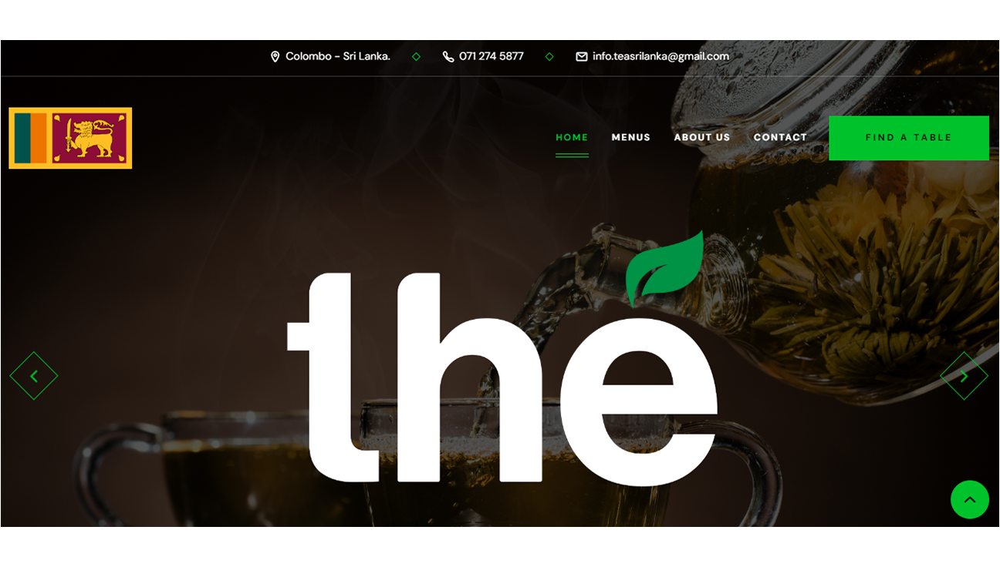

# Thé - Tea Sri Lanka Website

Welcome to the official repository for the **Thé - Tea Sri Lanka** website. This website showcases our premium selection of Sri Lankan teas and provides an online platform for tea enthusiasts to explore, learn, and shop.

## Features

- **Elegant Design**: A clean and modern design that reflects the elegance of Sri Lankan tea culture.
- **Product Showcase**: Detailed pages for each tea product, including descriptions, pricing, and images.
- **Interactive UI**: User-friendly navigation with interactive elements for an engaging user experience.
- **Responsive Layout**: Fully responsive design to ensure a seamless experience on both desktop and mobile devices.

## Technologies Used

- **HTML**: Structure and content of the website.
- **CSS**: Styling and layout, including custom animations and responsive design.
- **JavaScript**: Interactive elements and dynamic content.

## Getting Started

To run this website locally, follow these steps:

1. **Clone the repository**:
   ```bash
   git clone https://github.com/tenzaicbt/the-tea-website.git


### Demo Screeshots



